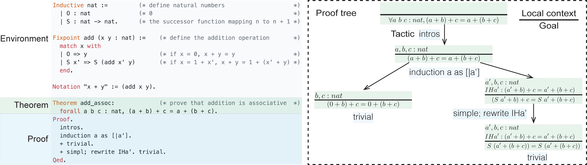

# CoqGym



Code for the paper:  

[Learning to Prove Theorems via Interacting with Proof Assistants](https://arxiv.org/abs/1905.09381)      
Kaiyu Yang and Jia Deng   
International Conference on Machine Learning (ICML) 2019   

```
@inproceedings{yang2019coqgym,
  title={Learning to Prove Theorems via Interacting with Proof Assistants},
  author={Yang, Kaiyu and Deng, Jia},
  booktitle={International Conference on Machine Learning},
  year={2019},
}
```


## Table of Contents

1. [Installing CoqGym](#1-installing-coqgym)  
    &nbsp; &nbsp;  1.1 [Dependencies](#11-dependencies)  
    &nbsp; &nbsp;  1.2 [Building Coq, SerAPI, CoqHammer, and the Coq Projects](#12-building-coq-serapi-coqhammer-and-the-coq-projects)  
    &nbsp; &nbsp;  1.3 [Extracting the Proofs from Coq Code](#13-extracting-the-proofs-from-coq-code-optional)  
    &nbsp; &nbsp;  1.4 [Downloading the Pre-extracted Proofs](#14-downloading-the-pre-extracted-proofs-recommended)  
2. [Using CoqGym in a Container](#2-using-coqgym-in-a-container)   
    &nbsp; &nbsp;  2.1 [Dependencies](#21-dependencies)  
    &nbsp; &nbsp;  2.2 [Downloading the Pre-built Container Image](#22-downloading-the-pre-built-container-image)  
    &nbsp; &nbsp;  2.3 [Using the Container](#23-using-the-container)  
    &nbsp; &nbsp;  2.4 [Building the Container by Yourself](#24-building-the-container-by-yourself)   
3. [Data Format](#3-data-format)   
    &nbsp; &nbsp;  3.1 [JSON Files](#31-json-files)   
    &nbsp; &nbsp;  3.2 [LMDB File](#32-lmdb-file)   
    &nbsp; &nbsp;  3.3 [Gloassary](#33-glossary)    
4. [Data Utilities](#4-data-utilities)   
    &nbsp; &nbsp;  4.1 [Interacting with CoqGym](#41-interacting-with-coqgym)   
    &nbsp; &nbsp;  4.2 [Parsing Coq Terms](#42-parsing-coq-terms)   
    &nbsp; &nbsp;  4.3 [Computing Dataset Statistics](#43-computing-dataset-statistics)   
5. [The ASTactic Model](#5-the-astactic-model)  
    &nbsp; &nbsp;  5.1 [Prerequisites](#51-prerequisites)  
    &nbsp; &nbsp;  5.2 [Extracting Proof Steps](#52-extracting-proof-steps)  
    &nbsp; &nbsp;  5.3 [Training](#53-training)  
    &nbsp; &nbsp;  5.4 [Testing](#54-testing)  
    
    
---

## 1. Installing CoqGym


Follow these steps to obtain the CoqGym dataset and build the environment for interacting with it. 
Alternatively, you may also use CoqGym in a [container](#2-using-coqgym-in-a-container).


### 1.1 Dependencies

* [OPAM](https://opam.ocaml.org/)
* [Anaconda Python 3](https://www.anaconda.com/distribution/)
* [LMDB](https://symas.com/lmdb/)
* [Ruby](https://www.ruby-lang.org/en/)


### 1.2 Building Coq, SerAPI, CoqHammer, and the Coq Projects

1. Create an OPAM switch for OCaml 4.07.1+flambda: `opam switch create 4.07.1+flambda && eval $(opam env)`
1. Upgrade the installed OPAM packages (optional): `opam upgrade && eval $(opam env)`
1. Clone the repository: `git clone https://github.com/princeton-vl/CoqGym`
1. Install Coq, SerAPI and CoqHammer: `cd CoqGym && source install.sh`
1. Build the Coq projects (can take a while): `cd coq_projects && make && cd ..`
1. Create and activate the conda environment: `conda env create -f coq_gym.yml && conda activate coq_gym`

*Note*: [Coq](https://github.com/coq/coq), [SerAPI](https://github.com/ejgallego/coq-serapi), [CoqHammer](https://github.com/lukaszcz/coqhammer), and the Coq projects in the [coq_projects](./coq_projects) directory are indendent software projects with their own code repositories, but please follow the instructions above to build the specific versions we need.

### 1.3 Extracting the Proofs from Coq Code (Optional)

We include the code for extracting CoqGym from Coq source code. However, it is not guaranteed to reproduce exactly the same data. The timeout and other miscellaneous errors during the data extraction may be machine-dependent. For example, a faster machine is likely to have fewer timeout errors and thus can extract more proofs.
For benchmark purpose, please download and use our pre-extracted version of CoqGym.

1. Check all Coq files and locate the proofs:   
    For each `*.meta` file in `./coq_projects/`, run `python check_proofs.py --file /path/to/*.meta`   
    Now you have generated a `*.json` file in `./data/` corresponding to each `*.meta` file. The `proofs` field of the JSON object is a list containing the proof names.
    
2. Extract the proofs:  
    For each `*.meta` file and each proof, run:  
    `python extract_proof.py --file /path/to/*.meta --proof $PROOF_NAME`  
    `python extract_synthetic_proofs.py --file /path/to/*.meta --proof $PROOF_NAME`

3. Post-processing: `python postprocess.py`

*Caveat*: The steps above are computationally expensive. When we say "For each XXX, run `YYY`", the tasks are embarrassingly parallel, which means you can run them in parallel in any order. We do not provide the code for that because it depends on a particular HPC infrastructure.


### 1.4 Downloading the Pre-extracted Proofs (Recommended)

1. Download the CoqGym dataset [here](https://drive.google.com/drive/folders/149m_17VkYYkl0kdSB4AI8zodCuTmPaA6?usp=sharing)

2. Unzip the data and set the paths: `python unzip_data.py`

*Caveat*: The second step sets the absolute paths in the data. You have to re-do it whenever the absolote path of the `data/` directory changes (e.g. after moving the entire repo to another directory).

Now you are ready to interact with CoqGym! Run `python eval_env.py` to check if it terminates normally without raising an error.


---


## 2. Using CoqGym in a Container

As a less painful alternative to [installing CoqGym](#1-installing-coqgym) from scratch, we provide a pre-built Singularity container.
Feel free to skip these steps if you have finished installing CoqGym.
Currently we do not support GPUs for the container, therefore you have to complete the installation steps manually if you want to train models on CoqGym using GPUs.


### 2.1 Dependencies

* [Singularity](https://singularity.lbl.gov/)


### 2.2 Downloading the Pre-built Container Image

The container image can be downloaded [here](https://drive.google.com/drive/folders/13Rwa5no6W4MwSvdjRrENAdDCQqTWhcqy?usp=sharing).

### 2.3 Using the Container

1. Start a shell session inside the container: `singularity shell coq_gym.simg`
1. Run `source /.bashrc && cd /CoqGym && eval $(opam env) && conda activate coq_gym`

You are now ready to use CoqGym! Try `python eval_env.py` to see if it terminates normally without raising an error.  
For further instructions about how to use a Singularity container, please consult the documentation of Singularity.


### 2.4 Building the Container by Yourself 

We provide a [Singularity recipe](./Singularity) from which you can build the container by yourself. 

1. You need to be on a Linux machine of which you have sudo privileges.
1. Download the dataset [here](https://drive.google.com/drive/folders/149m_17VkYYkl0kdSB4AI8zodCuTmPaA6?usp=sharing) and put the files in your `CoqGym/` directory.
1. Run `sudo singularity build coq_gym.simg Singularity` to build the container image `coq_gym.simg`


*Caveat*: If you run out of disk space when building the container, it may because your `/tmp` directory is not large enough. See https://singularity.lbl.gov/build-environment#temporary-folders for a workaround.


---


## 3. Data Format

The dataset contains three parts:

* The `data` directory: `*.json` files corresponding to the `*.v` files in Coq source code, whose format is explained below. The `*.json` files contain all important information about the proofs: environment, local context, goals, tactics, proof trees, etc.

* The `sexp_cache` directory: A LMDB file that serves as an index for the S-expressions in `*.json` files. The `*.json` files contain keys for querying `sexp_cache`

* `projs_split.json`: A JSON object containing the training/validation/testing split

### 3.1 JSON Files

Each `*.json` file in `data/` corresponds to a Coq source file `*.v` in `coq_projects/`. For example, `data/StructTact/Assoc.json` corresponds to [coq_projects/StructTact/Assoc.v](https://github.com/princeton-vl/CoqGym/blob/master/coq_projects/StructTact/Assoc.v). 

The format of the JSON files is described below. 
The hash codes are used as keys to query the LMDB `sexp_cache`.
Consult the [glossary](#33-glossary) for the terminology.
```
{
    'filename': 'Assoc.v',            # the path of the Coq source file relative to the root directory of the Coq project
    'coq_project': 'StructTact',      # the name of the Coq project
    'vernac_cmds': [                  # a list of Coq commands [6] in the source file
        ['Cd "$COQGYM_ROOT/coq_projects/StructTact".', 'VernacChdir',  '3701e61f37b72b3e61788fce6317466b7bb92b55'],     # [raw command, command type, command AST (in hash code)]
        ['Arguments a_equiv {_} {_} _ _ _.', 'VernacArguments', '6777d3c472595dae20427d0892ad03d38f70fde9'],
        ...
        ['Arguments a_equiv {_} {_} _ _ _.', 'VernacArguments', '6777d3c472595dae20427d0892ad03d38f70fde9'],
    ],
   'num_extra_cmds': 107,             # the code in the original Coq file starts at vernac_cmds[num_extra_cmds]
   'proofs': [                        # a list of human-written proofs
       ...
    ],
    'synthetic_proofs': [             # a list of synthetic proofs
       ...
    ],
}
```


The format for a proof is as follows, taking the [`get_set_same`](https://github.com/princeton-vl/CoqGym/blob/9267aeb9acd82b7735d0228c4f366f7b843a852b/coq_projects/StructTact/Assoc.v#L47) in `coq_projects/StructTact/Assoc.v` as an example.


```
{
    'name': get_set_same,             # the name of the theorem
    'line_nb': 118,                   # the theorem is defined in $file_data['vernac_cmds'][$line_nb]
    
    'env_delta': {                          # the global environment relative to the previous proof in the same file
        'add' : {                           # entries that should be added to the environment
            'constants' : [
                {
                    'physical_path': 'coq/theories/Arith/PeanoNat.vo:Nat.mul_wd',       # the unique identifier
                    'short_ident': 'PeanoNat.Nat.mul_wd',                               # the short identifier
                    'qualid': 'Coq.Arith.PeanoNat.Nat.mul_wd',             # the qualified identifier [1]
                    'type': '@Morphisms.Proper (forall (_ : nat) (_ : nat), nat) (@Morphisms.respectful nat (forall _ : nat, nat) (@eq nat) (@Morphisms.respectful nat nat (@eq nat) (@eq nat))) Nat.mul',    # the type [7] of the constant
                    'sort': 'Prop',                                        # the sort [2] of the constant (the type of its type) [2]
                    'opaque': False,                                       # whether the constant is opaque or transparent [3]
                    'sexp': '333b2895c8e62d21856476bf89fa9681c9058bb9'     # the S-expression [4] of the constant produced by SerAPI
            },   
            ...
            ],
            'inductives' : [
                {
                    'physical_path' : 'coq/theories/Init/Wf.vo:Acc',
                    'blocks': [           # a list of blocks in a mutual inductive definition [5]. For regular inductive definitions (most cases), the list has length 1
                        {
                            'short_ident': 'Acc',
                            'qualid': 'Coq.Init.Wf.Acc',
                            'constructors': [
                                ['Acc_intro', 'forall (A : Type) (R : forall (_ : A) (_ : A), Prop) (x : A) (_ : forall (y : A) (_ : R y x), _UNBOUND_REL_6 A R y), _UNBOUND_REL_5 A R x'],      # [constructor name, constructor type]
                                ...
                            ]
                        }
                    ],
                    'is_record': False,
                    'sexp': '31537cb98179ad7d2de0dd2cc783b4672b34b25b'
            }
            ...
            
            ],
        },
        'subtract' : {                      # entries that should be removed from the environment
            'constants' : [],
            'inductives' : [],
        },
    },
    
    'steps': [                        # a list of proof steps
        {
            'command': ['induction l; intros; simpl; repeat (break_match; simpl); subst; congruence.', 'VernacExtend', 'f6d2cb314d72d23562e5f2ef2657bd2589d44794'],        # (raw command, command type, command AST (in hash code)) the Coq command (usually a tactic but also includes other commands such as +, -, *, etc.) 
            'goal_ids': {             # the IDs of the goals in the current proof step
                'fg': [27],           # focused goals 
                'bg': [] .            # unfocused goals
            }
        }
        ...
    ],      
    
    'goals' {                         # the goals
        27': {                        # $goal_id -> goal
                 'id': 27,            # the goal ID
                 'type': 'forall (k : K) (v : V) (l : list (prod K V)), @eq (option V) (assoc (assoc_set l k v) k) (@Some V v)',      # the type (logical statement) of the goal
                 'hypotheses': [      # the local context, a list of local premises
                     {'idents': ['K', 'V'], 'term': [], 'type': 'Type', 'sexp': 'cd1531c49fce6657997962b5375a3ef0a59db34a'}       # {'idents': [a list of identifiers of the premises (usually of length one)], 'term': [a list of Coq terms (usually empty)], 'type': the type (logical statement) of the premise}
                     {'idents': ['K_eq_dec'], 'term': [], 'type': "forall k k' : K, sumbool (@eq K k k') (not (@eq K k k'))", 'sexp': '5f5f5bcf9e10621f8c0c4642c0eba3ff36cbfff8'},
                 ],
             }
    },    
    
    'proof_tree' : {                  # the proof tree
        'goal_id': 27, 'children': []
    },                     
}
```

### 3.2 LMDB File

`sexp_cache` is a LMDB mapping hash codes in `*.json` files to their corresponding S-expressions. Below is a code snippet in Python for accessing them.
```Python
from utils import SexpCache
sexp_cache = SexpCache('sexp_cache')
print(sexp_cache['333b2895c8e62d21856476bf89fa9681c9058bb9'])
```

### 3.3 Glossary

1. [qualified identifier](https://coq.inria.fr/distrib/current/refman/language/gallina-specification-language.html#qualified-identifiers-and-simple-identifiers) 
2. [sort](https://coq.inria.fr/distrib/current/refman/language/gallina-specification-language.html#sorts)
3. [opaque, transparent](https://coq.inria.fr/distrib/current/refman/language/gallina-specification-language.html#sorts)
4. [S-expression](https://en.wikipedia.org/wiki/S-expression)
5. [inductive definition, mutual inductive definition](https://coq.inria.fr/distrib/current/refman/language/gallina-specification-language.html#mutually-defined-inductive-types)
6. [Coq (vernac) command](https://coq.inria.fr/distrib/current/refman/language/gallina-specification-language.html#mutually-defined-inductive-types)
7. [type](https://coq.inria.fr/distrib/current/refman/language/gallina-specification-language.html#types)


---


## 4. Data Utilities

We include some tools for interacting with CoqGym, but they are NOT a part of the dataset. 
You may implement your own tools for similar purposes.


### 4.1 Interacting with CoqGym

`eval_env.py` enables the interaction with the proofs in CoqGym. 
See [ASTactic/agent.py](ASTactic/agent.py) for examples.


### 4.2 Parsing Coq Terms

* `gallina.py`: a parser the S-expressions of Coq terms. 
It may be useful for learning the embeddings of the term ASTs. 

* `utils.py`: functions for iterating through all proofs or Coq files in the dataset.


### 4.3 Computing Dataset Statistics 

* `stats/count_human_proofs.py`: count the number of human-written proofs in CoqGym.

* `stats/count_synthetic_proofs.py`: count the number of synthetic-written proofs in CoqGym.

* `stats/proofs.py`: compute some statistics of the proofs.


---


## 5. The ASTactic Model


Here we describe how to train and test the ASTactic model on CoqGym. 
The following content is NOT a part of the CoqGym dataset, and therefore you do not need it if you only want to access the data.

### 5.1 Prerequisites

* Make sure CoqGym has been properly installed and configured. The `coq_gym` conda environment is activated, the OPAM switch is on `4.07.1+flambda`.
* Automated theorem provers: [Vampire](https://vprover.github.io), [CVC4](http://cvc4.cs.stanford.edu/), [Eprover](http://www.eprover.org), and [Z3](https://github.com/Z3Prover/z3). Install all of them and make sure they are accessible in PATH, otherwise you may see a performance degradation of the hammer baseline.
* [PyTorch](https://pytorch.org/): Install the correct version for your hardware in the conda environment `coq_gym`.
* The instructions below assume that you are in the [ASTactic](./ASTactic/) directory.


### 5.2 Extracting Proof Steps

The ASTactic model is trained on individual proof steps, rather than entire proofs.
After obtaining the CoqGym dataset, run `python extract_proof_steps.py`. This can take a while, and you have the option to run it in parallel, please see the `--filter` option in the source code for details.


The extracted proof steps are in `proof_steps/`. You can double-check the number of proof steps to make sure everything works as expected: 

Directory |  # files
------------ | -------------
proof_steps/train | 121,644
proof_steps/valid | 68,180


### 5.3 Training

To train on the proof steps in training + validation set: `python main.py --no_validation --exp_id astactic`  
The "astactic" above is an experiment ID, and you may change it to other IDs. Model checkpoints will be saved to `runs/astactic/checkpoints/`. See `options.py` for command line options.

A pre-trained model can be downloaded [here](https://drive.google.com/drive/folders/1AzLaEpoGS3BPMUz9Bl63MHAFRqlF4CtH?usp=sharing).


### 5.4 Testing 

Assuming you want to test the model checkpoint `runs/astactic/checkpoints/model_003.pth` on the proof `get_set_same` in `../data/StructTact/Assoc.json`:

* Testing ASTactic:   
    `python evaluate.py ours ours-TEST --path runs/astactic/checkpoints/model_003.pth --file ../data/StructTact/Assoc.json --proof "get_set_same"`

* Testing an automated tactic X (may be "auto", "trivial", "easy", "intuition", or "hammer"):   
    `python -u evaluate.py X X-TEST --file ../data/StructTact/Assoc.json --proof "get_set_same"` 

* Testing ASTactic+X:   
    `python -u evaluate.py ours+X ours+X-TEST --path runs/astactic/checkpoints/model_003.pth --file ../data/StructTact/Assoc.json --proof "get_set_same"`


*Caveat*: Testing is computationally expensive, but the workloads are embarrassingly parallel, which means you can run them in parallel in any order. We do not provide the code for that because it depends on a particular HPC infrastructure.
